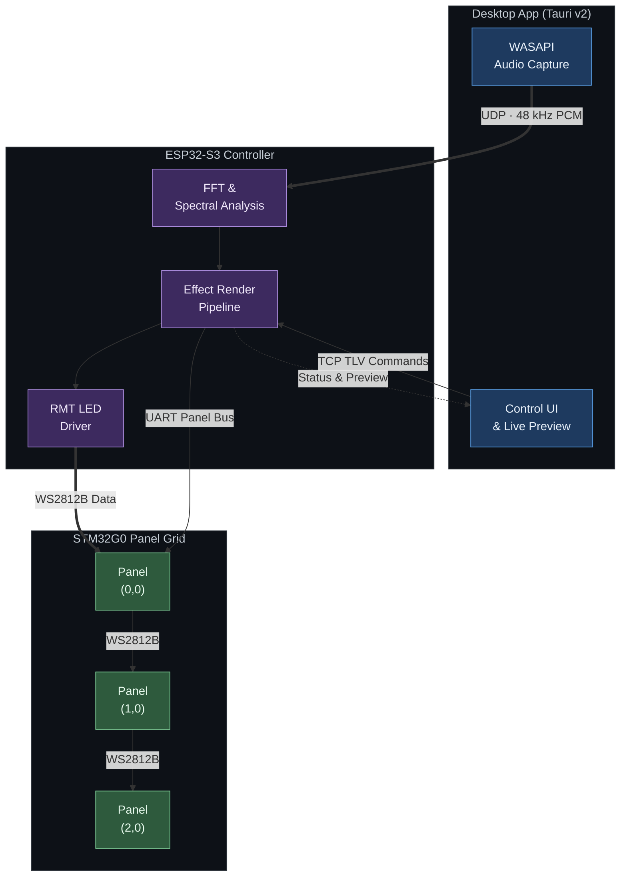

# Pulse Box

**Configurable LED grid controller built on ESP32-S3 and FreeRTOS**

<!-- TODO: Replace with GIF/photo of LED grid running effects -->

[Pulse Box in action](https://github.com/user-attachments/assets/6c7008e8-37e6-4140-984e-331421be73a4)

A real-time embedded system that drives expandable WS2812B LED grids with a library of visual effects, runtime-tunable parameters (brightness, speed, direction, color palette), and a companion desktop app for control and live preview. Panels connect via a custom UART-based bus with automatic BFS topology discovery — the controller detects the grid shape, computes signal routing, and rebuilds the pixel canvas without configuration. A subset of effects are audio-reactive, driven by a 2048-point FFT running on-chip from audio streamed over WiFi.

`ESP32-S3` | `FreeRTOS` | `Dual-Core Architecture` | `Custom Panel Bus Protocol` | `Expandable Grid` | `30 FPS Render Pipeline`

---

## System Overview



Pulse Box is a three-part system: the **ESP32-S3 controller** (this repository) runs a 30 FPS render pipeline with multiple visual effects and drives the LED hardware, optional **[STM32G0 panel boards](https://github.com/michael-michelotti/pulse-box-panel)** extend the display into larger grids through a custom UART-based Type-Length-Value (TLV) panel bus. A **[desktop application](https://github.com/michael-michelotti/pulsebox-desktop)** provides a control interface with live preview and can stream system audio for audio-reactive effects.

The controller runs six FreeRTOS tasks across both cores of the ESP32-S3, with the rendering pipeline isolated on Core 0 and all network I/O on Core 1 to prevent WiFi jitter from affecting frame timing.

| Repository                                                                           | Description                                                                |
| ------------------------------------------------------------------------------------ | -------------------------------------------------------------------------- |
| **[pulse-box-esp](https://github.com/michael-michelotti/pulse-box-esp)** (this repo) | ESP32-S3 controller firmware — FreeRTOS tasks, rendering, protocols        |
| **[pulsebox-desktop](https://github.com/michael-michelotti/pulsebox-desktop)**       | Tauri v2 desktop app — audio capture, device discovery, control UI         |
| **[pulse-box-panel](https://github.com/michael-michelotti/pulse-box-panel)**         | STM32G0 panel firmware — UART routing, mux control, topology participation |
| **[pulse-box-pcb](https://github.com/michael-michelotti/pulse-box-pcb)**             | KiCad schematics and board layouts for controller and panel PCBs           |

---

## Real-Time Architecture

The firmware's central design challenge is running a render pipeline at a stable 30 FPS while simultaneously receiving audio over WiFi, performing a FFT, handling TCP commands, managing panel discovery, and driving LEDs — all on a dual-core microcontroller with no OS-level memory protection.

### Task Layout

Tasks are pinned to cores by function: **Core 0** owns the framebuffer and all tasks that read or write pixel data, while **Core 1** handles network I/O and DSP, isolating WiFi stack jitter from the render loop.

| Task                  | Core | Priority    | Role                                                                                |
| --------------------- | ---- | ----------- | ----------------------------------------------------------------------------------- |
| `render_task`         | 0    | 5 (highest) | 30 FPS frame loop: effect compute, brightness scaling, gamma correction, LED output |
| `panel_bus_task`      | 0    | 4           | BFS topology discovery, snake-path mux routing, canvas rebuild                      |
| `console_task`        | 0    | 3           | UART command parsing (shared parser with TCP)                                       |
| `tcp_cmd_server_task` | 0    | 3           | TLV protocol server on port 5001 — accepts commands, pushes status/preview          |
| `udp_audio_task`      | 1    | 5 (highest) | Receives 48 kHz PCM over UDP, fills ping-pong buffer                                |
| `audio_fft_task`      | 1    | 4           | 2048-point FFT with Hann windowing, publishes spectral data                         |

WiFi and lwIP are also pinned to Core 1 via `sdkconfig`, keeping all network activity off the render core.

### Inter-Task Synchronization

Each boundary between tasks uses the lightest-weight primitive that satisfies its timing and safety requirements:

<!-- TODO: Replace with data flow diagram showing cores, tasks, and sync mechanisms -->


| Boundary                  | Mechanism                | Rationale                                                             |
| ------------------------- | ------------------------ | --------------------------------------------------------------------- |
| UDP &rarr; FFT            | `xTaskNotifyGive`        | Lightest signaling in FreeRTOS — no kernel object, just a TCB counter |
| FFT &rarr; Render         | Spinlock + double buffer | <1 &mu;s critical section, lock-free read path between swaps          |
| Console/TCP &rarr; Render | Direct store (no lock)   | 32-bit aligned stores are hardware-atomic on ESP32                    |
| Panel Bus &rarr; Render   | `volatile bool` flag     | Same-core tasks — no cache coherency concerns                         |

- **UDP &rarr; FFT:** The FFT task blocks on `ulTaskNotifyTake` until 2048 samples are ready. Direct task notification avoids allocating a queue or semaphore — it's a 32-bit counter on the target task's TCB.
- **FFT &rarr; Render:** Two complete `AudioState_t` structs with separate FFT bin arrays. The FFT task writes the back buffer, then swaps front/back pointers under a `portMUX_TYPE` spinlock. The render task copies the front buffer under the same spinlock. Critical section is <1 &mu;s — short enough to never cause a frame miss.
- **Console/TCP &rarr; Render:** Effect parameters (`brightness`, `speed`, etc.) are 32-bit aligned scalars. On ESP32, aligned 32-bit stores are atomic at the hardware level — no lock, no barrier, no overhead.
- **Panel Bus &rarr; Render:** Both tasks run on Core 0, so memory visibility is guaranteed. The panel bus task sets `canvas_updating = true` during canvas rebuilds; the render task checks the flag and skips the frame if set.

### Why This Architecture

WiFi is compute-intensive and bursty — the ESP32's WiFi stack can stall a core for hundreds of microseconds during TX/RX. Audio data also arrives in bursts. For that reason, those tasks were pined to Core 1 so the render task on Core 0 can be reliably serviced, keeping the frame rate at a smooth 30 FPS without competing with network traffic.

The sync primitives follow the same idea: keep the render task's worst-case blocking as short as possible (the spinlock copy at <1 &mu;s is the worst case — everything else is lockless).

---

## Panel Bus Protocol

<!-- TODO: Replace with photo/diagram of multi-panel grid -->


The PulseBox controller is meant to control a dynamically configurable grid of 8x8 LEDs. The panel bus protocol allows the controller to discover single 8x8 LED grids in an arbitrarily shaped multi-panel display without requiring the controller to individually address every panel over a shared bus.

Panels connect through mirrored 11-pin board-to-board connectors. The mirrored layout naturally crosses TX/RX when two panels mate face-to-face, so no crossover cables or pin swaps are needed. Each connector also carries a sense pin on one side and a ground pin in the matching position on the other — when a neighbor is plugged in, its ground pulls the sense line low, letting each panel detect neighbor presence via GPIO interrupt.

### Design Decisions

- **Per-side point-to-point UART** — Each panel has four UART links (N/E/S/W) to avoid the need for bus arbitration logic. The controller has two links (North and East) to seed the grid from position (0, 0).

- **XY coordinate addressing** — Panels are assigned grid coordinates during discovery (e.g., `(1,0)`, `(0,2)`). Addresses encode as `(x << 4) | y` in a single byte. Routing is dimension-ordered: X-axis first, then Y-axis — deterministic, deadlock-free, no routing tables.

- **BFS topology discovery** — On boot, the controller runs breadth-first search through sense GPIOs and UART links, assigning coordinates as it discovers panels. A proxy message (`DISCOVER_SIDE`) lets the controller discover panels multiple hops away through a single round-trip to a relay panel.

- **Snake-path mux routing** — The WS2812B data signal daisy-chains through the grid in a boustrophedon (snake) pattern. Each panel has two 4:1 analog muxes routing the LED data in and out. After discovery, the controller sends `SET_MUX` commands so each panel connects the right sides.

- **Automatic canvas rebuild** — After discovery, the firmware reconstructs the pixel canvas to span the full grid. Effects and the render pipeline work unchanged — they iterate `canvas.pixels[]` regardless of how many panels are connected.

### Wire Format

```
[SYNC: 0xAA] [DST: u8] [SRC: u8] [TYPE: u8] [LEN: u8] [PAYLOAD: 0..N] [CRC8: u8]
```

6 bytes of overhead. CRC-8 (polynomial 0x07) computed over DST through end of payload. See [`panel_bus.h`](main/panel_bus.h) for the full message type table.

---

## Network Protocols

### TCP Command Protocol (Port 5001)

Binary TLV framing for device control and status synchronization with the desktop app. The app connects, performs a HELLO/STATUS handshake, then sends commands and receives state updates and preview frames.

```
[type: u8] [length: u16 LE] [payload: length bytes]
```

| Type   | Name          | Direction            | Purpose                                                |
| ------ | ------------- | -------------------- | ------------------------------------------------------ |
| `0x01` | HELLO         | client &rarr; device | Protocol version handshake                             |
| `0x02` | CMD           | client &rarr; device | UTF-8 text command                                     |
| `0x03` | PIXEL_FRAME   | client &rarr; device | Raw RGB frame for direct pixel control                 |
| `0x81` | STATUS        | device &rarr; client | Full device state (effect, brightness, topology, etc.) |
| `0x82` | CMD_RESP      | device &rarr; client | Command acknowledgment with text response              |
| `0x83` | PREVIEW_FRAME | device &rarr; client | Live LED preview (post-brightness, pre-gamma)          |

### UDP Audio Stream (Port 5000)

48 kHz, 16-bit signed mono PCM. Each packet carries a 4-byte header (magic `0x5042` + sequence number) followed by 512 samples. Four packets fill the 2048-sample FFT window.

### WiFi Setup Flow

The controller implements a captive-portal-style setup flow:

1. **No credentials stored** &rarr; boots into AP mode (`PulseBox-Setup`, WPA2)
2. User connects to AP, sends WiFi credentials via TCP command
3. Controller saves credentials to NVS, reboots into STA mode
4. Advertises `pulsebox.local` via mDNS for zero-config discovery

---

## Project Structure

```
Pulse_Box/
├── main/                           # ESP32-S3 application firmware
│   ├── main.c                      # Init: NVS, WiFi STA/AP, mDNS, task creation
│   ├── wifi_audio.c                # UDP receiver + FFT tasks (Core 1)
│   ├── esp_led_driver.c            # WS2812B via RMT + DMA (GPIO 9)
│   ├── tcp_cmd_server.c            # TLV protocol server (port 5001)
│   ├── cmd_protocol.c              # TLV frame serialization/deserialization
│   ├── panel_bus.c                 # Panel discovery, routing, canvas rebuild
│   └── console.c                   # UART + TCP command parser
├── components/
│   └── pulse_engine/               # Portable rendering engine (zero ESP-IDF dependencies)
│       └── src/
│           ├── renderer.c          # Frame pipeline: clear → compute → brightness → gamma → send
│           ├── effects.c           # Visual effect implementations
│           ├── canvas.c            # Pixel layout and coordinate mapping
│           └── led_math.c          # Color math, palettes, HSV/RGB conversion
└── tools/
    ├── pulsebox-desktop/           # Desktop app (git submodule)
    ├── pulsebox-panel/             # STM32G0 panel firmware (git submodule)
    └── pulse-box-pcb/              # PCB designs (git submodule)
```

The `pulse_engine` component is a portable C library with no platform dependencies — it was originally written for an STM32F407 and runs on the ESP32-S3 without modification.

---

## Building and Flashing

### Prerequisites

- [ESP-IDF v5.x](https://docs.espressif.com/projects/esp-idf/en/latest/esp32s3/get-started/)
- ESP32-S3 target board (custom v2 controller PCB or ESP32-S3-DevKitC-1 N8R8)

### Build

```bash
idf.py set-target esp32s3    # First time only
idf.py build
idf.py flash monitor         # Flash and open serial console
```

### First-Time Setup

1. Flash the firmware — the controller boots with no WiFi credentials and starts an access point (`PulseBox-Setup`, password: `pulsebox123`)
2. Connect to the AP and open the [desktop app](https://github.com/michael-michelotti/pulsebox-desktop), then connect manually to `192.168.4.1:5001`
3. Enter your WiFi credentials — the controller saves them to NVS and reboots into station mode
4. The desktop app discovers the controller automatically via mDNS (`pulsebox.local`)

---

## Hardware

<!-- TODO: Replace with photo of the controller PCB -->


- **Controller:** Custom v2 PCB with ESP32-S3-WROOM (N8R8 — 8 MB flash, 8 MB PSRAM)
- **Panel boards:** Custom PCB with STM32G071C8T6 (Cortex-M0+), 4 UART links, 2 analog muxes
- **LEDs:** WS2812B, 8x8 grids per panel, driven via RMT peripheral with DMA
- **Interconnect:** 11-pin board-to-board connectors carrying 24V power, UART, sense, and WS2812B data

| Function                             | GPIOs      |
| ------------------------------------ | ---------- |
| LED data (RMT + DMA)                 | 9          |
| Panel bus North (UART1 TX/RX, sense) | 39, 40, 14 |
| Panel bus East (UART2 TX/RX, sense)  | 47, 48, 42 |
| Panel mux select                     | 10         |
| Status LED                           | 41         |
| USB console (UART0)                  | 43, 44     |

See **[pulse-box-pcb](https://github.com/michael-michelotti/pulse-box-pcb)** for schematics and board layouts.

---

## Related Repositories

- **[pulsebox-desktop](https://github.com/michael-michelotti/pulsebox-desktop)** — Tauri v2 desktop app with WASAPI audio capture, device discovery, live preview, and control UI
- **[pulse-box-panel](https://github.com/michael-michelotti/pulse-box-panel)** — STM32G0 panel firmware handling UART routing, mux control, and topology participation
- **[pulse-box-pcb](https://github.com/michael-michelotti/pulse-box-pcb)** — KiCad schematics and PCB layouts for the v2 controller and panel boards
